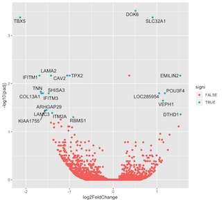

```{r setup, include=FALSE}
knitr::opts_chunk$set(echo = TRUE, eval=FALSE)
```

This is material largely adapted from Software Carpentry and Data Carpentry lessons as well as from tutorials and writings from Omayma Said, Hadley Wickham, Anne Segonds-Pichon, and Kieran Healy. We're always on the lookout for more relevant and directly applicable problems and datasets for the demonstrations, so feel free to contact us if you have any...

## Learning objectives

### After completing this tutorial you will be:

- Familiar with the concepts behind ggplot
- Familiar with the ggplot core syntax
- Able to create basic graphs using the ggplot elements

## Prerequisites

### Before starting this tutorial you should know:

- Your way around the RStudio interface
- Basic R syntax and concepts
- How to enter or download data into R
- How to navigate the R documentation
- How to install and call R packages
- Make sure you have the ggplot2 package installed

## What is ggplot?

You may already be familiar with R's base plotting capabilities. Generally speaking, the base plotting functions tell R how to *draw* your graph. For example, base R plotting knows how to draw a bar graph, but we must tell it how to draw error bars. ggplot is an R package that implements a different way to instruct R to graph data by *declaring* the properties of the desired graph and having R/ggplot combine them.

For very simple data graphics, base and ggplot code is not that much different. The power of ggplot starts to become apparent the more elaborate your visualization needs to be.

## Getting started

Make sure you have an R/RStudio install, settle into a working directory and, if you don't have ggplot installed:

```{r}
install.packages("ggplot2")
library(ggplot2)
```

## Comparison example

Let's start with plotting our old friend, the E.Coli strains dataset, with the base R plotting functions

```{r}
download.file(url="https://osf.io/ga9re/download", destfile="ecolidata.csv")
straindata <- read.csv("ecolidata.csv")
genomesize <- straindata$genome_size
plot(genomesize)
```

So far, so good. To customize our plot, we need to refer to the graphical elements, like point symbol (pch) and title (main):

```{r}
plot(genomesize, pch=8, main="Scatter plot of genome sizes")
```

## The ggplot way...

With the Grammar of Graphics, we declare elements of our plot (variables, axes,...) and how they map to graphical characteristics. It's helpful to think about it as building the plot by layers.

```{r}
ggplot(straindata) #Why is this blank?
ggplot(straindata) + geom_point() #Check the error message
```

ggplot expects that we declare the mapping of variables to visuals before plotting (Recall the layers slide).
Note also how the plot can be built by *adding* elements and layers.

```{r}
ggplot(data=straindata, mapping=aes(x=sample, y=genome_size)) #data= and mapping= are optional
```

Now let's add how we want the points to look like:

```{r}
ggplot(data=straindata, mapping=aes(x=sample, y=genome_size)) + geom_point()
# Data layer + Mapping layer + Points layer
```

Let's customize a bit more but, to save typing, let's start storing our plot into an object:

```{r}
myplot <- ggplot(data=straindata, mapping=aes(x=sample, y=genome_size)) + geom_point()
myplot + ggtitle("Scatter plot of genome sizes")
myplot + ggtitle("Scatter plot of genome sizes") + theme_bw()
# Added a built-in theme to the theme layer
```

See the ggplot theme documentation for an idea of what other visual customizations can be made to the final look of the plot.

Visual elements, not just axes, can be mapped to variables. Can you tell what is going on here?

```{r}
myfancyplot <- ggplot(straindata, aes(x=sample, y=genome_size, color=generation, shape=cit))+
  geom_point()
myfancyplot
```

Reading the geom_point documentation, we see that we can define size to customize.

## The boxplot example

Recall how we did a boxplot of this EColi data...

```{r}
boxplot(genome_size ~ cit, straindata, col=c("pink", "purple", "darkgrey"),
        main="Average Expresion Differences", ylab="Genome Size")
```

This is the ggplot equivalent. Note that we can write the mapping inside the geom if we wish.

```{r}
myboxplot <- ggplot(straindata) +
  geom_boxplot(aes(x=cit, y=genome_size, fill=cit))
myboxplot
myboxplot + ggtitle("Boxplot of genome size by citrate mutant")+
  xlab("Citrate mutant") +
  ylab("Genome Size (Mb)") # Text labels layer
```

To save plots from within R code:
```{r}
ggsave("boxplot.pdf", myboxplot)
```

So far, you should have some idea of how the ggplot syntax works. For these simple plots, you may note that we don't save much in typing versus base plots (though we gain in better-looking plots by default). We will run through a few more examples to show some of the advantages versus base functions.

\pagebreak

## Group exercise: Make a volcano plot

From wikipedia:

>In statistics, a volcano plot is a type of scatter-plot that is used to quickly identify changes in large data sets composed of replicate data. It plots significance versus fold-change on the y and x axes, respectively. These plots are increasingly common in omic experiments such as genomics, proteomics, and metabolomics where one often has a list of many thousands of replicate data points between two conditions and one wishes to quickly identify the most meaningful changes. 

We want to make the graph above (more or less):



First, let's download and examine the data:
```{r}
download.file(url="https://osf.io/3rwmz/download",destfile="geneexpression.csv")
genedata <- read.csv("geneexpression.csv")
# Examine the genedata table, check data types and ranges
```

Let's do this as a group exercise, look at the goal and ask yourselves:

- What are we mapping?

- Do we need to manipulate the data first?

- What are the geometric objects and how do their properties match?

- What customizations and refinements would we want to employ?

Remember you can save your "scratchpad" as an R script for future reference...

## Working with gapminder data

Next, we will work with the gapminder dataset, a table of country-wide statistics. If you are on your own computer you can just install the data as a package:

```{r}
# If you are on your own computer
install.packages("gapminder")
library(gapminder)
```

If you are in one of our teaching lab computers, you won't be allowed to install packages, but you can download the data table directly:

```{r}
# If on the Teaching Lab computers:
download.file("https://github.com/jennybc/gapminder/raw/master/data/gapminder.rdata",
              destfile="gapminder.rdata")
load("gapminder.rdata")
```

Remember to inspect your data after import...

## Plotting gapminder data

Let's start with a simple scatter of GDP per capita versus Life Expectancy

```{r}
ggplot(data = gapminder, aes(x = gdpPercap, y = lifeExp)) + geom_point()
```

### Exercise: Plot how life expectancy has changed over time

### Exercise: Plot how life expectancy has changed over time per continent

Since we are looking at changes over time, maybe a line plot is better:

```{r}
ggplot(data = gapminder, aes(x = year, y = lifeExp, color=continent)) + geom_line()
```

Well, that's confusing. Can you tell why? (hint: look at how the data table is shaped)

```{r}
ggplot(data = gapminder, aes(x = year, y = lifeExp, color=continent, by=country)) + geom_line()
# by is a grouping parameter
```

What if we want both lines and points? Remember drawing is in layers:

```{r}
ggplot(data=gapminder, aes(x = year, y = lifeExp, by=country)) +
  geom_line(aes(color=continent)) + geom_point(color="black")
```

And now you see why we can write aes inside geoms: we may wish to map different variables/visuals to different elements of our plot. In this case, we drew a scatterplot on top of a line plot (Test for yourself by switching the order of the geoms). By the way, why did we not write an aes inside the geom_point in the example above?

## Plotting with transforms and stats

Let's go back to our first gapminder plot

```{r}
ggplot(data=gapminder, aes(x=gdpPercap, y=lifeExp, color=continent)) + geom_point()
```

Points are kind of smushed together. We can make it easier to see by changing the x axis scale and by making them a bit transparent:

```{r}
firstgap <- ggplot(data=gapminder, aes(x=gdpPercap, y=lifeExp, color=continent)) +
  geom_point(alpha = 0.5) + scale_x_log10()
firstgap
```

Besides this kind of transform, we can add some fits to our plot:

```{r}
firstgap + geom_smooth(method="lm") #Trying a linear fit
```

Note that the geom_smooth layer took account of our global groupings before adding the fit.

### Exercise: modify the plot so that we end up with a single linear fit of all the data

Note how the modularity of the ggplot syntax makes it easier to modify the plot in non-trivial ways.

## More customization

Let's get back to our line plot. It was pretty busy. Faceting the data may make the data more readable:

```{r}
mylines <- ggplot(data=gapminder, aes(x=year, y=lifeExp, color=continent, by=country)) +
  geom_line()
mylines
mylines + facet_wrap( ~ country)
```

That's 142 plots. Takes a bit.

For the next example, let's try working on a subset of the countries...

```{r}
# grab first letter or country
beginletter <- substr(gapminder$country, start=1, stop=1)
# grab only the data from countries that start with A
A.countries <- gapminder[beginletter == "A", ]
Alineplot <- ggplot(data=A.countries, aes(x=year, y=lifeExp, color=continent)) +
  geom_line() + facet_wrap( ~ country)
Alineplot
```

So seven plots renders a bit quicker... Still, this ain't ready for publication quite yet. We can further customize the text by changing the label and theme layers:

```{r}
Alineplot +
  labs(x="Year", y="Life Expectancy", title="Figure 1", color="Continent") +
  theme(axis.text.x=element_blank(), axis.ticks.x=element_blank())
# Getting rid of x-ticks and text
```

\pagebreak

### Optional exercise: Make a density plot (see geom_density documentation) of GDP per capita by continent, faceted per year

## Resources and where to go from here:

We've covered the very basics of plotting with ggplot (try a Google image search of 'ggplot' if you don't believe me). Below are some helpful resources to help you learn more:

- The ggplot official site (https://ggplot2.tidyverse.org/)

- The R for Data Science book (free at https://r4ds.had.co.nz) is pretty much indispensable to start learning how to do modern data analysis and data visualization with R/RStudio.

- Data Visualization: A practical introduction (free at https://socviz.co/) is a shorter introduction to the same topics, though not just visualizaiton. Though most of the examples are sociology-flavored, it may be a better starting point than the encyclopedic R4DS book.

- ggplot cookbook (http://www.cookbook-r.com/Graphs/index.html) has some handy tricks for quick lookup.

- Another "cookbook" for ggplot code is maintained by Jennifer Bryan at (http://shiny.stat.ubc.ca/r-graph-catalog/)

- Don't forget the R-bloggers blog aggregator (https://www.r-bloggers.com/) is also invaluable, alongside the usual suspects like Stack Overflow when looking for starting points. E.g. search for 'gene heatmaps' to see how different people handle plotting microarray data instead of figuring it out from scratch.

- Another, more beginner-friednly aggregator is the *Awesome-R* site. Check out the Graphics section: (https://awesome-r.com/#awesome-r-graphic-displays)

- To become a true ggplot expert, you'll probably have to go through Hadley Wickham's "ggplot2: Elegant Graphics for Data Analysis" book. Buy it from Amazon, request it from the library, or build it from source at (https://github.com/hadley/ggplot2-book).
